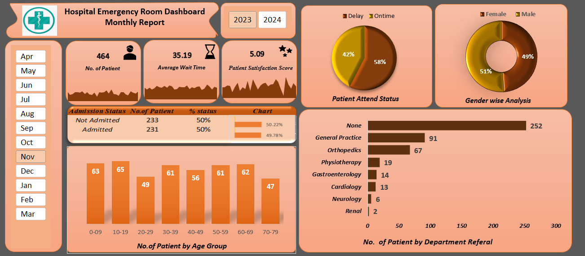

# Hospital Emergency Room Dashboard
## 📊 Project Overview
This project is an interactive Hospital Emergency Room Dashboard created using Microsoft Excel.
The dashboard helps analyze emergency room patient data and presents important insights through KPIs, charts, and interactive filters.
## 🎯 Project Objective
The main objective of this project is to transform hospital emergency room data into a clear and interactive dashboard for data analysis and reporting.
## 📌 Key Performance Indicators (KPIs)
- **Number of Patients** – Shows the total number of patients visiting the emergency room.
- **Average Wait Time** – Shows the average time patients waited to see a medical professional.
- **Patient Satisfaction Score** – Shows the average patient satisfaction score.
## 📈 Analysis Included
The dashboard provides analysis of:

- Patient Attend Status
- Admission Status
- Gender-wise Analysis
- Patient Age Groups
- Department Referrals
- Monthly Patient Analysis
- Patient Trends

## 🛠️ Tools & Techniques Used
- Microsoft Excel
- Pivot Tables
- Excel Charts
- Interactive Dashboard
- Data Analysis
- Data Visualization

## 📊 Dashboard Preview

## 📁 Project Files
### Excel Dashboard
`Hospital Emergency room Dashboard.xlsx`
Contains the interactive Excel dashboard and analysis.
### Dataset
`Hospital Emergency Room Data.csv`
Contains the hospital emergency room patient data used for analysis.
### Dashboard Image
`dashboard.png`
Preview image of the completed dashboard.
## 💡 Key Dashboard Features
- Monthly filtering from April to March
- Year selection
- KPI cards
- Patient trend analysis
- Admission status analysis
- Gender-wise analysis
- Age group analysis
- Department referral analysis
## 📚 Learning Outcome
Through this project, I practiced working with Excel-based data analysis, dashboard creation, Pivot Tables, charts, KPIs, and data visualization.
## 👩‍💻 Project Created By
**Arati Bhokare**
Aspiring Data Analyst
